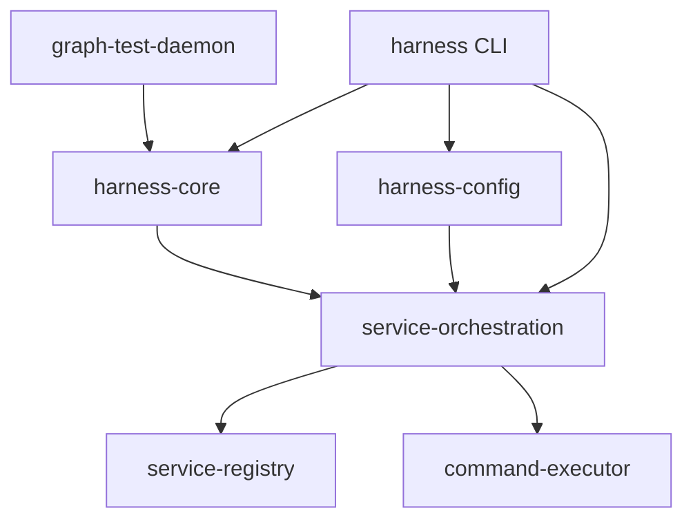

# Graph Network Harness Architecture

## Overview

The Graph Network Harness is a layered, runtime-agnostic service orchestration framework designed for testing distributed systems, with specialized support for Graph Protocol components.

## System Architecture

```
┌─────────────────────────────────────────────────────────────────────┐
│                          User Applications                           │
├─────────────────────────────────────────────────────────────────────┤
│                         graph-test-daemon                            │
│            (Graph Protocol-specific testing daemon)                  │
├─────────────────────────────────────────────────────────────────────┤
│                            harness CLI                               │
│              (User interface for service management)                 │
├─────────────────────────────────────────────────────────────────────┤
│                          harness-core                                │
│        (Core abstractions: Daemon, Service, Action traits)          │
├─────────────────────────────────────────────────────────────────────┤
│                      service-orchestration                           │
│          (ServiceManager, executors, health monitoring)              │
├─────────────────────────┬───────────────────────────────────────────┤
│    service-registry      │             harness-config                │
│  (Service discovery)     │         (YAML configuration)             │
├─────────────────────────┴───────────────────────────────────────────┤
│                        command-executor                              │
│              (Layered command execution system)                      │
└─────────────────────────────────────────────────────────────────────┘
```

## Crate Dependencies



## Core Components

### 1. command-executor

**Purpose**: Provides runtime-agnostic command execution with composable layers.

**Key Types**:
- `Command`: Builder for executable commands with stdin support
- `Launcher` / `Attacher`: Traits for starting new processes vs attaching to existing ones
- `LayeredExecutor` / `LayeredAttacher`: Composable execution through layers
- `ProcessHandle` / `AttachedHandle`: Different handle types for managed vs attached services

**Execution Layers**:
- `LocalLayer`: Direct local execution
- `SshLayer`: SSH command wrapping
- `DockerLayer`: Docker exec wrapping

**Example**:
```rust
let executor = LayeredExecutor::new(LocalLauncher)
    .with_layer(SshLayer::new("user@host"))
    .with_layer(DockerLayer::new("container"));

let (events, handle) = executor.execute(command, &Target::Command).await?;
```

### 2. service-registry

**Purpose**: Service discovery and network topology management.

**Key Components**:
- `Registry`: Central service registration and discovery
- `NetworkManager`: Manages network topology (LAN, WireGuard, etc.)
- `ServiceInfo`: Runtime information about services

**Features**:
- Persistent storage of service state
- WebSocket-based pub/sub for service events
- Network topology awareness

### 3. service-orchestration

**Purpose**: High-level service lifecycle management across heterogeneous backends.

**Key Types**:
- `ServiceManager`: Central orchestrator
- `ServiceConfig`: Service definition with target, dependencies, health checks
- `ServiceExecutor` trait: Interface for different execution backends
- `RunningService`: Runtime service information

**Executors**:
- `ProcessExecutor`: Local process management
- `DockerExecutor`: Docker container management
- `SshExecutor`: Remote SSH execution
- `SystemdExecutor`: Systemd service management (planned)

**Example**:
```rust
let manager = ServiceManager::new().await?;
let config = ServiceConfig {
    name: "my-service".to_string(),
    target: ServiceTarget::Process { 
        binary: "my-app".to_string(),
        args: vec!["--port".to_string(), "8080".to_string()],
        env: HashMap::new(),
        working_dir: None,
    },
    dependencies: vec![],
    health_check: Some(HealthCheck { /* ... */ }),
};
let running = manager.start_service("my-service", config).await?;
```

### 4. harness-config

**Purpose**: YAML configuration parsing and variable resolution.

**Key Features**:
- Service definition parsing
- Environment variable substitution
- Service reference resolution (e.g., `${postgres.ip}`)
- Configuration validation

**Example YAML**:
```yaml
version: "1.0"
services:
  postgres:
    type: docker
    image: postgres:15
    env:
      POSTGRES_PASSWORD: ${DB_PASSWORD:-secret}
  
  api:
    type: process
    binary: ./api
    env:
      DATABASE_URL: postgresql://postgres:${DB_PASSWORD}@${postgres.ip}:5432/db
    dependencies:
      - postgres
```

### 5. harness-core

**Purpose**: Core abstractions for building domain-specific service daemons.

**Key Traits**:
- `Daemon`: Base daemon interface
- `Service`: Actionable service with typed actions/events
- `Action`: Executable actions with JSON parameters

**Components**:
- `BaseDaemon`: Default daemon implementation
- `ServiceStack`: Registry of available services
- `ActionRegistry`: Registry of daemon-level actions

**Example**:
```rust
#[async_trait]
pub trait Service: Send + Sync {
    type Action: DeserializeOwned + JsonSchema;
    type Event: Serialize + JsonSchema;
    
    fn name(&self) -> &str;
    fn description(&self) -> &str;
    async fn dispatch_action(&self, action: Self::Action) -> Result<Receiver<Self::Event>>;
}
```

### 6. harness (CLI)

**Purpose**: Command-line interface for service management.

**Architecture**:
- **Client Mode**: Connects to daemon via WebSocket/TLS
- **Daemon Mode**: Embedded daemon server
- **Commands**: start, stop, status, daemon management

**Communication Protocol**:
```rust
pub enum Request {
    StartService { name: String, config: ServiceConfig },
    StopService { name: String },
    GetServiceStatus { name: String },
    ListServices,
    // ...
}

pub enum Response {
    Success,
    Error { message: String },
    ServiceStarted { name: String, network_info: ServiceNetworkInfo },
    ServiceStatus { status: ServiceStatus },
    // ...
}
```

### 7. graph-test-daemon

**Purpose**: Graph Protocol-specific testing daemon.

**Services**:
- `GraphNodeService`: Subgraph deployment and querying
- `AnvilService`: Local Ethereum blockchain
- `PostgresService`: Database management
- `IpfsService`: IPFS node management

**Actions**:
- Deploy subgraphs
- Mine blocks with epoch awareness
- Create allocations
- Verify indexing status

## Design Principles

### 1. Runtime Agnostic
All crates use runtime-agnostic libraries:
- `async-process` instead of `tokio::process`
- `async-net` instead of `tokio::net`
- `smol` for testing

### 2. Layered Architecture
Each layer has a single responsibility:
- Command execution is separate from service management
- Service orchestration is separate from configuration
- Domain-specific logic is separate from core infrastructure

### 3. Type Safety
- Strongly typed service configurations
- Type-safe action dispatch with JSON Schema
- Compile-time verification of service dependencies

### 4. Composability
- Execution layers can be stacked
- Services can be mixed (local, Docker, remote)
- Actions can be composed into workflows

## Event Flow

### Service Start Sequence

1. **User Command**: `harness start postgres`
2. **Configuration Loading**: Parse YAML, resolve variables
3. **Dependency Resolution**: Topological sort of service graph
4. **Daemon Communication**: Send `StartService` request
5. **Service Manager**: Select appropriate executor
6. **Executor**: Build command using command-executor
7. **Process Launch**: Start service with event streaming
8. **Health Monitoring**: Wait for service to be healthy
9. **Registry Update**: Register service for discovery

### Event Streaming

```
Service Process ─────► Event Stream ─────► ServiceManager ─────► Client
     │                      │                    │                  │
     ├─ stdout             ├─ ProcessEvent     ├─ Filters         ├─ Display
     ├─ stderr             ├─ Typed Events     ├─ Aggregates      └─ Logging
     └─ exit               └─ Lifecycle        └─ Health Status
```

## Extension Points

### 1. New Service Types
Implement the `Service` trait in harness-core:
```rust
struct MyService;

impl Service for MyService {
    type Action = MyAction;
    type Event = MyEvent;
    // ...
}
```

### 2. New Executors
Implement the `ServiceExecutor` trait:
```rust
struct KubernetesExecutor;

impl ServiceExecutor for KubernetesExecutor {
    async fn start(&self, config: ServiceConfig) -> Result<RunningService> {
        // Deploy to Kubernetes
    }
}
```

### 3. New Execution Layers
Implement the `ExecutionLayer` trait:
```rust
struct VpnLayer;

impl ExecutionLayer for VpnLayer {
    fn wrap_command(&self, command: Command, context: &ExecutionContext) -> Result<Command> {
        // Wrap command to run through VPN
    }
}
```

## Future Enhancements

1. **Multi-Node Orchestration**: Coordinate services across multiple machines
2. **Service Mesh**: Advanced networking with Envoy/Linkerd integration
3. **Metrics & Tracing**: OpenTelemetry integration
4. **Web UI**: Browser-based management interface
5. **Kubernetes Backend**: Deploy services to K8s clusters
6. **State Machines**: Formal service lifecycle modeling